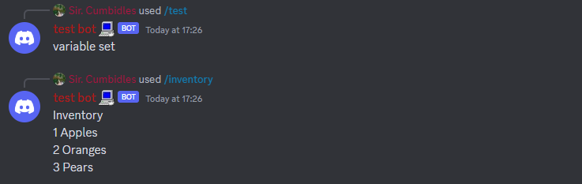

`Last Updated: 11/06/2023 3:31PM, GMT+10` <br>
- *Finished /warn and /check-warns JSON List guide.*

# BDFD Variables with JSON
Bot Designer for Discord is an excellent app but one issue you may encounter making your bot is the variable limit, this guide will introduce you to using JSON with variables to be able to save yourself a massive amount of variables.

This guide will explain how to setup JSON variables, update users variables, setup an economy system and a levels system + a little extra. I hope its easy to understand and that this guide helps you on your bot developing journey. 

- **Important Information**
  - [JSON Functions](#json-functions) 
    > [$jsonParse](#jsonparseparsing) <br>
    > [$jsonSetString](#jsonsetstringstringvalue) <br>
    > [$json](#jsonstring) <br>
  - [/start & setting json variables](#start-and-update)
    > [Setting up your /start command](#setting-up-your-start-command) <br>
  - [Setting Up After /start](#setting-up-after-start) <br>
    > [Version Checking](#version-checking) <br>
    > [/update](#update) <br>
- **Basic Guides.**
  - [Adding to JSON Strings](#adding-to-json-strings)
    > [$calculate](#calculate) <br>
    > [/add-cash](#add-cash) <br>
    > [/remove-cash](#remove-cash) <br>
    > [Boosters](#boosters) <br>
  - [Economy and Items With Json](#economy-system)
    > [/balance](#balance) <br>
    > [/work](#work) <br>
    > [Dynamic /inventory](#dynamic-inventory) <br>
    > [/buy & /sell](#sell--buy) <br>
  - [XP & Levels](#xp--levels)
    > [/profile](#profile) <br>
    > [XP in Commands](#xp-in-commands) <br>
    > [Leveling Up](#leveling-up) <br>
    > [XP Booster Item](#xp-booster-item) <br>
    > [/use](#use) <br>
    > [Item Durability](#item-durability) <br>
  - [JSON Lists](#xp--levels)
    > [JSON List Introduction](#json-list-introduction) <br>
    > [Using a JSON List to Store User Warnings](#using-a-json-list-to-store-user-warnings) <br>
    > [/warn](#warn) <br>
    > [/check-warns](#check-warns) <br>
    > [Using a JSON List to Store Item Stats](#using-a-json-list-to-store-item-stats) <br>

# JSON Functions
### $jsonParse[parsing]
The first step to using Json in any way with BDSript2 is with `$jsonParse[]` this Function takes one input which is your JSON Code. But do not worry for you will not need to code any JSON while using this guide. <br> <br> in this guide we will be storing our JSON code in variables. which would look like this.
```
$jsonParse[$getVar[VARNAME;$authorID]]
```
For example if we have a variable called items and in it we have stored apples, oranges and pears then `$getVar[items;$authorID]]` would input the json string for these items into `$jsonParse` allowing us to modify them as we please with `$jsonSetString`. <br>
### $jsonSetString[string;value]
`$jsonSetString` will be the Function you use most in these examples and allows you to modify your values with no JSON knowledge at all! for example in the code shown below we will create a variable in the app called `items` set the value of this variable to `{}` by default for now. We will now add apples, oranges and pears and how many of each item the user has with the code shown below. <br>
(Slash Command - /test)
```
$nomention
$jsonParse[$getVar[items;$authorID]]
$jsonSetString[apples;1]
$jsonSetString[oranges;2]
$jsonSetString[pears;3]
$setVar[items;$jsonStringify;$authorID]

variable set
```
*you may notice here that we use `$setVar[items;$jsonStringify;$authorID]` to save the JSON code, the Function `$jsonStringify` will output the parsed json code along with any changes that have been made to it since it was parsed, this is important to remember!* <br>

### $json[string]
Now that you have set your JSON code you can use `$json` to get whatever values you have stores, in this example we are going to use `$json` to get how many apples, oranges and pears we have. <br>
(Slash Command - /inventory)
```
$nomention
$jsonParse[$getVar[items;$authorID]]

Inventory
$json[apples] Apples
$json[oranges] Oranges
$json[pears] Pears
```
 <br>
*The two blocks of code will output these results.*

# /start and /update
Now that you understand the basics i will explain an important part of JSON variables, which is a /start command and a Version Checker (explained later). The purpose of a `/start` command is to set the users variables with the correct json code before they can use any other command. this ensures no errors occur later down the line as for example a command may add an +1 apple to the user, but if `$json[apple]` doesnt return a number then the code can break. <br>

### Setting up your /start command
To get started make a variable named `started` and set the value to `false`, the /start command we are going to make below will include the items, stats and other json information we will use in the guides below. If you later for example a new item to your bot after you set this command up then it can cause errors unless you have a Version Checker which will be explained later. <br>
(Slash Command - /start) <br>
(Variables: <br>
`Name: stats, Value: {}` <br>
`Name: items, Value: {}`) <br>
```
$nomention
$if[$getVar[started;$authorID]==true]
$title[you have already used /start]
$else
$jsonParse[$getVar[stats;$authorID]]
$jsonSetString[cash;0]
$jsonSetString[xp;0]
$jsonSetString[lvl;0]
$jsonSetString[lvlR;100]
$jsonSetString[multi;1]
$setVar[stats;$jsonStringify;$authorID]

$jsonParse[$getVar[items;$authorID]]
$jsonSetString[apples;0]
$jsonSetString[oranges;0]
$jsonSetString[pears;0]
$setVar[items;$jsonStringify;$authorID]

$title[/start success]
$endif
```
## Setting up After /start
Now lets say you want to add a new fruit to your bot but lots of people have already started, you cant make them all use /start again or there stuff will get reset and you feel like you have lost all hope to update your bot and its all because of json. Have no fear for Version Checking is here a system i myself have designed and use that makes updating users json variables easier than ever before! <br>
### Version Checking
The first step is to actually setup a Version Checker this can be done in a JSON Variable so make a new one with the name `versions` and set the value as `{}` now add this $if block to every command you make.
```
$if[$getVar[started;$authorID]==false]
$title[you haven't started yet please use /start]
$else
$jsonParse[$getVar[versions;$authorID]]
$if[$or[$json[0.1]==false]]
$title[This bot has updated since you last used it!]
$description[use /update to fix this up :)]
$else
$c[Your commands code]
$endif
$endif
```
Now every time you update your bot you will have to go to each of your commands and add that new version to the checker, for example if i release another version `0.2` i update `$if[$or[$json[0.1]==false]]` to this `$if[$or[$json[0.1]==false;$json[0.2]==false]]` and if i make a `0.2.1` for example i then make it `$if[$or[$json[0.1]==false;$json[0.2]==false;$json[0.2.1]==false]]` and so on. <br>
### /update
Now once you have setup your Version Checker lets say you want to add a new fruit for example Bananas. You will make a new command `/update` and start it of like this.
```
$nomention
$if[$getVar[started:$authorID]==true]
$jsonParse[$getVar[versions;$authorID]]
$if[$and[$json[0.1]==true]
$title[Your already up to date!]
$else
$c[UPDATE CODE]
$endif
$else
$title[you havent started yet use /start]
$endif
```
<br> Now you need to set up the actual variable update, this can be done pretty easily with `$jsonSetString` and `$jsonParse` inside of `$if` blocks, this example below will add Bananas to the `items` variable for users who have already used `/start`
```
$nomention
$if[$getVar[started:$authorID]==true]
$jsonParse[$getVar[versiosn;$authorID]]
$if[$and[$json[0.1]==true]
$title[Your already up to date!]
$else
$c[UPDATER START]
$var[version;$jsonStringify] // Store the version json code this is if you have multiple versions made so that its able to correctly update multiple versions at the same time.
$if[$json[0.1]==false]
$jsonSetString[0.1;true]
$var[version;$jsonStringify] // Saves update for later.
$jsonParse[$getVar[items;$authorID]] // Parse our items variable.
$jsonSetString[bananas;0] // Add Bananas
$setVar[items;$jsonStringify;$authorID] // Save new item
$endif
$c[if adding another version add below the last one for example if i was to make a v0.2 i would place it in this line.]
$setVar[versions;$var[version];$authorID]]
$c[UPDATER END]
$title[Update Successfull]
$else
$title[you havent started yet use /start]
$endif
```
<br> If you ever plan to make another update to lets say add Lettuce then just use this code below and add the new updates to the area indicated. place this code below the $endif of the last version you made.
```
$jsonParse[$var[version]]
$if[$json[0.1]==false]
$jsonSetString[0.1;true]
$var[version;$jsonStringify] // Saves update for later.
// updates added in version (new items, stats, tools etc etc.)
$endif
```
*remember to add new versions to all your commands Version Checkers and to `$if[$and[$json[0.1]==true]` in the /update command*

# Adding to JSON Strings
Now that we got the essentials out the way lets get into actually using these JSON variables to do stuff, Below i will explain `$calculate` and how to use it with `$json, $jsonParse and $jsonSetString` to modify a users cash and set up a cash multiplier. <br>
### $calculate
`$calculate[equation]` is a combined version of `$sum, $sub, $multi, $divide and $modulo` this function is more efficient and will be what we use throughout this guide below are some examples of how it can be used. <br>
`$calculate` uses these expressions to do its math. <br>
`+ Addition,` <br>
`- Subtraction,` <br>
`* Multiplication,` <br>
`/ Division,` <br>
`% Modulo.` <br>
Here are some examples of it being used with `$jsonSetString`
```
$c[+500 Cash Example]
$jsonSetString[cash;$calculate[$json[cash]+500]]

$c[-500 Cash Example]
$jsonSetString[cash;$calculate[$json[cash]-500]]

$c[Double Users Cash]
$jsonSetString[cash;$calculate[$json[cash]*2]]

$c[Halve Users Cash]
$jsonSetString[cash;$calculate[$json[cash]/2]]
```
### /add-cash
In this section we will make a command that adds a inputted amount of cash to a user. Firstly we must make a slash command and name it `add-cash` this slash command will need two options which can be added below where you name and set the description of your slash command. The first option you need is `user` set this to a user input and mark it as required. The second option will be called `amount` leave the input type as the default and set it as required. <br>
Now we will use the code below to add to the selected users cash.
```
$nomention
$jsonParse[$getVar[stats;$message[user]]
$jsonSetString[cash;$calculate[$json[cash]+$message[amount]]]
$setVar[stats;$jsonStringify;$message[user]]
$title[added $message[amount] cash to user]
```

### /remove-cash
We can reverse the effect in another command with the same options but lets name it `remove-cash` swap the `+` in `$jsonSetString` with a `-` and now you have a command that removes cash from the inputted user.
```
$nomention
$jsonParse[$getVar[stats;$message[user]]
$jsonSetString[cash;$calculate[$json[cash]-$message[amount]]]
$setVar[stats;$jsonStringify;$message[user]]
$title[added $message[amount] cash to user]
```
### Boosters
This example will use the xp and level values we setup in our `/start` command, if you have followed this guide correctly in the variable stats your should have the values of these strings stored `xp, lvl, lvlR and multi` the purpose of each of these are as listed. <br>
`xp - how much XP the user has,` <br>
`lvl - what Level the user is,` <br>
`lvlR - how much XP the user must hit to level up,` <br>
`multi - how much the users xp gain is multiplied by. (default is 1 so theres no boost.)` <br>
In the code below we will use `$jsonSetString` along with `$calculate` to setup an XP multi whenever your giving the user xp.
```
$jsonParse[$getVar[stats;$authorID]]
$jsonSetString[xp;$calculate[$json[xp]+($random[1;6]*$json[multi])]]
$setVar[stats;$jsonStringify;$authorID]
```
*This code will be expanded on later in the guide when we explain leveling up.*
# Economy System

### /balance
Though we have already gone over `$json` we will one last time give a basic idea on how it works using a `./balance` command, this code below will display the users balance. <br>
(Slash Command - /balance)
```
$nomention
$if[$getVar[started;$authorID]==false]
$title[you haven't started yet please use /start]
$else
$jsonParse[$getVar[versions;$authorID]]
$if[$or[$json[0.1]==false]]
$title[This bot has updated since you last used it!]
$description[use /update to fix this up :)]
$else
$jsonParse[$getVar[stats;$authorID]]
$title[$username's Balance]
$description[cash: $$json[cash]]
$endif
$endif
```
*always remember to include your /start check and your Version Checker in every command you make!*
### /work
Here we will list another simple command to help you understand how to use `$json` with `$calculate` this command has a 30 second cooldown and will give the user `$5-55` every time its ran.
(Slash Command - /work)
```
$nomention
$if[$getVar[started;$authorID]==false]
$title[you haven't started yet please use /start]
$else
$jsonParse[$getVar[versions;$authorID]]
$if[$or[$json[0.1]==false]]
$title[This bot has updated since you last used it!]
$description[use /update to fix this up :)]
$else
$jsonParse[getVar[stats;$authorID]]
$var[reward;$random[5;56]] $c[Here we are storing how much the user will get running the command.]
$jsonSetString[cash;$calculate[$json[cash]+$var[reward]]]
$setVar[stats;$jsonStringify;$authorID]
$title[$username ran /work]
$description[> $username Worked and managed to earn $$var[reward]]
$endif
$endif
```
### Dynamic /inventory
Sick of Static Inventorys? (ones that show every item the bot has even if you have none of that item.) Well i have the solution for you, it took a little bit of work but i managed to workout the best way to make Dynamic Inventories using the code below. This example `/inventory` will only show items that you have atleast 1 of using our apples, oranges and pears values from earlier examples. <br>
(Slash Command - /Inventory)
```
$nomention
$if[$getVar[started;$authorID]==false]
$title[you haven't started yet please use /start]
$else
$jsonParse[$getVar[versions;$authorID]]
$if[$or[$json[0.1]==false]]
$title[This bot has updated since you last used it!]
$description[use /update to fix this up :)]
$else
$jsonParse[$getVar[items;$authorID]]
$c[The code below is designed to allow each item to have there own line on the embed. it must be laid our exactly this way.]
$if[$json[apples]>0] $var[apples;- $json[apples]x Apples
] $else $endif
$if[$json[oranges]>0] $var[oranges;- $json[oranges]x Oranges
] $else $endif
$if[$json[pears]>0] $var[pears;- $json[pears]x Pears
] $else $endif

$title[$username's Inventory]
$description[$var[apples]$var[oranges]$var[pears]
]
$endif
$endif
```
*add more `$if` blocks and `$var`'s for each item you have.*
### /sell & /buy
This section will show you how to make a /sell command and a /buy command so you can buy and sell your precious apples, oranges and pears. We will be doing a different method than what you may be used to but doing it like this allows for more efficiency. Firstly we will make `/sell` once you have the slash command made add two options both set as required, the first option have it named `item` and enable predefined choices, create 3 choices set there **names** as `Apple [$3 Each]`, `Orange [$5 Each]`, `Pear [$8 Each]` and set there **values** as `apples`, `oranges`, `pears`. For the second option call it `amount` and just have it set as required. <br>

Now that you have that setup this will be your `/sell` commands code.
```
$nomention
$if[$getVar[started;$authorID]==false]
$title[you haven't started yet please use /start]
$else
$jsonParse[$getVar[versions;$authorID]]
$if[$or[$json[0.1]==false]]
$title[This bot has updated since you last used it!]
$description[use /update to fix this up :)]
$else
$jsonParse[$getVar[items;$authorID]]
$if[$json[$message[item]]>=$message[amount]]
$if[$message[item]==apples] $var[sellPrice;3] $c[here we are saving how much you will get per what item you selected.]
$elseif[$message[item]==oranges] $var[sellPrice;5]
$elseif[$message[item]==pears] $var[sellPrice;8]
$endif

$jsonSetString[$message[item];$calculate[$json[$message[item]]-$message[amount]]]
$setVar[items;$jsonStringify;$authorID]

$jsonParse[$getVar[stats;$authorID]
$jsonSetString[cash;$calculate[$json[cash]+($message[amount]*$var[sellPrice])]]
$setVar[stats;$jsonStringify;$authorID]
$else
$title[you dont have enough $var[item] for this]
$endif
$endif
$endif
```

Now for our `/buy` command you will make two options one `item` and one `amount`. We will have the same names and values as before in the `item` option but with the prices set to `$1, $3` and `$5` the below code is for a `/buy` command using JSON.
```
$nomention
$if[$getVar[started;$authorID]==false]
$title[you haven't started yet please use /start]
$else
$jsonParse[$getVar[versions;$authorID]]
$if[$or[$json[0.1]==false]]
$title[This bot has updated since you last used it!]
$description[use /update to fix this up :)]
$else
$jsonParse[$getVar[items;$authorID]]
$if[$json[$message[item]]>=$message[amount]]
$if[$message[item]==apples] $var[buyPrice;1] $c[here we are saving how much it will cost per item inputted.]
$elseif[$message[item]==oranges] $var[buyPrice;3]
$elseif[$message[item]==pears] $var[buyPrice;5]
$endif

$jsonSetString[$message[item];$calculate[$json[$message[item]]+$message[amount]]]
$setVar[items;$jsonStringify;$authorID]

$jsonParse[$getVar[stats;$authorID]
$jsonSetString[cash;$calculate[$json[cash]-($message[amount]*$var[buyPrice])]]
$setVar[stats;$jsonStringify;$authorID]
$else
$title[you dont have enough cash for this]
$endif
$endif
$endif
```
# XP & Levels

### /profile
Here we are gonna make a basic /profile command to display how much cash we have and our XP and Level. This can all be done pretty easily with `$json`
```
$nomention
$if[$getVar[started;$authorID]==false]
$title[you haven't started yet please use /start]
$else
$jsonParse[$getVar[versions;$authorID]]
$if[$or[$json[0.1]==false]]
$title[This bot has updated since you last used it!]
$description[use /update to fix this up :)]
$else

$jsonParse[$getVar[stats;$authorID]]
$title[$username's Profile]
$description[**User:** @username
> Cash: $json[cash]
> Level: $json[lvl]
(XP | $json[xp]/$json[lvlR]]

$endif
$endif
```
*this code will display what the image below shows if you have setup your `/start` command correctly* <br>

### XP in Commands
Now for this example we are gonna grab our `/work` command from [here](work) and add this code below to it. (be sure to place it after the /start check and version checker as you would with all other commands.)
```
$jsonParse[$getVar[stats;$authorID]]
$jsonSetString[xp;$calculate[$json[xp]+($random[1;6]*$json[multi])]]
// Level up code in the next segment goes here.
$setVar[stats;$jsonStringify;$authorID]
```
*remember to keep `$json[multi] there as we will use this for an XP Booster item later in this guide*
### Leveling Up
Now that we have getting XP setup we are gonna use this simple `$if` block in the area designated in the last example to check if the user has enough xp to level up, and if they do it will remove the amount of xp it took to level up and add `1` level to the user.
```
$if[$json[xp]>=$json[lvlR]]
$jsonSetString[xp;$calculate[$json[xp]-$json[lvlR]]]
$jsonSetString[lvl;$calculate[$json[lvl]+1]]
$endif
```
*you can also use this code below in the `$if` block to increase the amount of XP needed to level up each time the user levels up.*
```
$jsonSetString[lvlR;$calculate[$json[lvlR]+10]]
```
### XP Booster Item
Now we are going to setup an item that can give a 2.5x XP boost when using commands, to avoid having to setup a new JSON Version we are just going to use our already existing apples to do this. Below i will detail how to make a `/use <item>` command and how to setup an Item Durability.

### /use
Firstly we are going to make a slash command called `/use`
### Item Durability

# JSON List Introduction
This is the most advanced section of the guide we will be using `$textSplit` and `$splitText` in some parts of this section so it is advised to familiar yourself with these before going fowards. If you have already used these functions before or just simply dont care we will start off with how to create a JSON List.
### Using a JSON List to Store User Warnings
The first step to creating a Json List is making a variable for it, we are going to name this variable `warnings` and set the value of it to `{"warns":"0"}` now that you have that sorted we are going to make a command to warn a user. <br>
The way a JSON List works is each warning is marked with a number `1, 2, 3, 4, etc..` and the value `{"warns":"0"}` we added before we tally how many warns there is. We then make a `/check-warns <user` command that will be able to display 1 warning per page which will be explained after `/warn`.
### /warn
Now firstly we will need to make a command called `warn` add to `required` options one option will be `user` set as a user option, and our second option is `reason` set as a text option. <br>
We will now make this simple command that will add a warn to the user using our JSON List.
```
$jsonParse[$getVar[warnings;$message[user]]]
$jsonSetString[warns;$calculate[$json[warns]+1]]
$var[warning;$json[warns]]
$jsonSetString[w-$var[warning];R;$message[reason]]
$jsonSetString[w-$var[warning];I;$authorID]
$setVar[warnings;$jsonStringify;$message[user]]

$title[<@$message[user]> Warned]
$description[> Warning Number: $var[warning]
> Warning Reason: $message[reason]
]
```
### /check-warns
Now we are going to need one more JSON Variable, so make a new variable and call it `warnPage` and set the value to `{}`. Now we will make a slash command called `check-warns` with one option named `user` set this as a user option. We will start by placing this code into the command. <br>
(Slash Command - /check-warns <user>)
```
$nomention
$jsonParse[$getVar[warnings;$message[user]]]
$var[pages;$json[warns]]
$var[page;1]
$var[reason;$json[w-$var[page];R]]
$var[moderator;$json[w-$var[page];I]]
$jsonParse[$getVar[warnPage;$message[user]]]
$jsonSetString[page;1]
$jsonSetString[pages;$var[pages]]
$setVar[warnPage;$jsonStringify;$authorID]
$title[<@$message[user]>'s Warning History]
$color[FF044]
$description[Warning - $var[page]
Issued By: <@$var[moderator]> ($var[moderator])

Warn Reason: $var[reason]]
$footer[Warning $var[page]/$var[pages]]
$addButton[no;prev-$authorID;<;danger;yes;]
$if[$var[pages]>1] $addButton[no;next-$authorID;>;danger;no;]
$else $addButton[no;next-$authorID;>;danger;yes;]
$endif
```
Now that we have made this we need to add responses to our previous page and next page buttons that will allow people to move through the users warning history, Firstly we will start with our `next-$authorID` button by making a new command with the trigger as `$onInteraction` and in this place this code.
```
$nomention
$if[$customID==next-$authorID]
$removeButtons
$jsonParse[$getVar[warnPage;$authorID]]
$var[user;$json[user]]
$var[page;$calculate[$json[page]+1]]
$jsonSetString[page;$var[page]]
$setVar[warnPage;$jsonStringify;$authorID]
$jsonParse[$getVar[warnings;$var[user]]]
$var[pages;$json[warns]]
$var[reason;$json[w-$var[page];R]]
$var[moderator;$json[w-$var[page];I]]

$title[$username[$var[user]]’s Warning History]
$color[FF044]
$description[Warning • $var[page]
Issued By: <@$var[moderator]> ($var[moderator])

Warn Reason: 
> $var[reason]]
$footer[Warning $var[page]/$var[pages]]
$addButton[no;prev-$authorID;<;danger;no;]
$if[$var[page]<$var[pages]] $addButton[no;next-$authorID;>;danger;no;]
$else $addButton[no;next-$authorID;>;danger;yes;]
$endif
$endif
```
and now at the very button of our `$onInteraction` we will add the code for our `prev-$authorID` which is basically the same but slightly tweaked to work in reverse.
```
$if[$customID==prev-$authorID]
$removeButtons
$jsonParse[$getVar[warnPage;$authorID]]
$var[user;$json[user]]
$var[page;$calculate[$json[page]-1]]
$jsonSetString[page;$var[page]]
$setVar[warnPage;$jsonStringify;$authorID]
$jsonParse[$getVar[warnings;$var[user]]]
$var[pages;$json[warns]]
$var[reason;$json[w-$var[page];R]]
$var[moderator;$json[w-$var[page];I]]

$title[$username[$var[user]]’s Warning History]
$color[FF044]
$description[Warning • $var[page]
Issued By: <@$var[moderator]> ($var[moderator])

Warn Reason: 
> $var[reason]]
$footer[Warning $var[page]/$var[pages]]
$if[$var[page]==1] $addButton[no;prev-$authorID;<;danger;yes;]
$else $addButton[no;prev-$authorID;<;danger;no;]
$endif
$if[$var[page]<$var[pages]] 
$addButton[no;next-$authorID;>;danger;no;]
$else 
$addButton[no;next-$authorID;>;danger;yes;]
$endif
$endif
```
### Using a JSON List to Store Item Stats
